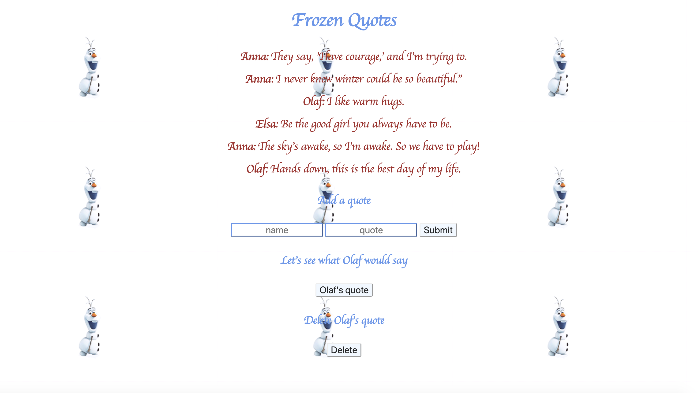

# Frozen Quotes

## Goal:

Create an app where users can post quotes from cartoon Frozen, see what Olaf would response to quotes and delete quote.

## How It's Made:

**Tech Used**: HTML5, CSS3, APIs, Javascript, Node.js, MongoDB, Express framework

## Installation

1. Clone repo
2. run `npm install`

## Usage

1. run `node server.js`
2. Navigate to `localhost:3000`

## Credit

Modified from Scotch.io's auth tutorial
